# Chapter 4: Filtering Operator
**Bongjin Lee**

이제 Combine 퍼블리셔를 조작하기 위해 사용하는 연산자들이 기본적으로 어휘라는 것을 깨달았을 것입니다. 더 많은 "단어"를 알수록 데이터에 대한 제어력이 높아집니다. 이전 장에서, 값을 소비하고 다른 값으로 변환하는 방법을 배웠습니다. 이는 일상 업무에서 가장 유용한 연산자 범주 중 하나입니다. 그러나 퍼블리셔가 방출하는 값이나 이벤트를 제한하고 일부만 소비하고 싶을 때는 어떻게 해야 할까요? 

이 장은 **필터링 연산자**라는 특별한 그룹의 연산자를 사용하여 이를 수행하는 방법에 관한 것입니다! 다행히도, 이러한 연산자 중 많은 부분은 Swift 표준 라이브러리에서 동일한 이름을 가진 유사한 기능을 가지고 있으므로 이 장의 내용을 필터링할 수 있는 경우 놀라지 마세요. :) 이제 바로 시작해보겠습니다.

이 장의 대부분의 연산자는 try 접두어를 가진 유사한 기능을 가지고 있습니다. 예를 들어, filter와 tryFilter가 있습니다. 둘의 유일한 차이점은 **후자가 예외를 발생시키는 클로저를 제공한다는 것**입니다. 클로저 내에서 발생시키는 오류는 해당 오류로 퍼블리셔를 종료시킵니다. 간결함을 위해 이 장에서는 거의 동일한 비 예외 버전만 다룰 것입니다.

# Filtering basics

이 첫 번째 섹션에서는 필터링의 기본 사항에 대해 다룹니다. 즉, 값의 퍼블리셔를 소비하고 조건에 따라 어떤 값을 소비자에게 전달할지 결정하는 것입니다. 이를 수행하는 가장 쉬운 방법은 이름에 걸맞은 연산자인 filter를 사용하는 것입니다. 이 연산자는 Bool 값을 반환하는 클로저를 받아서 제공된 조건에 맞는 값만 전달합니다.

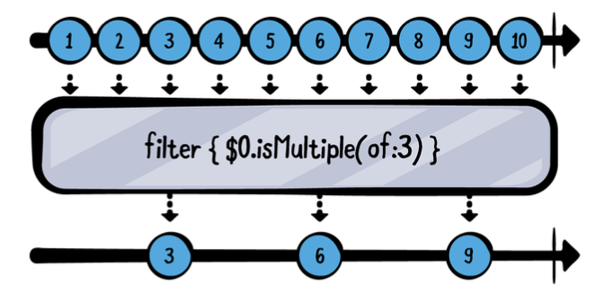

```
example(of: "filter") {
  // 1
  let numbers = (1...10).publisher
  // 2
  numbers
    .filter { $0.isMultiple(of: 3) }
    .sink(receiveValue: { n in
      print("\(n) is a multiple of 3!")
    })
    .store(in: &subscriptions)
}
```
위의 예제에서 여러분은:

1부터 10까지의 값을 방출하고 완료할 새로운 퍼블리셔를 생성합니다. 이는 Sequence 타입의 publisher 속성을 사용합니다.

filter 연산자를 사용하여 조건을 전달합니다. 여기서 3의 배수인 숫자만 통과하도록 합니다.
```
——— Example of: filter ———
3 is a multiple of 3!
6 is a multiple of 3!
9 is a multiple of 3!
```

앱을 사용하는 동안, 동일한 값을 연속으로 방출하는 퍼블리셔가 있을 때 이를 무시하고 싶을 때가 많습니다. 예를 들어, 사용자가 "a"를 다섯 번 연속으로 입력한 후 "b"를 입력하면, 과도한 "a"를 무시하고 싶을 수 있습니다.

Combine은 이 작업을 위한 완벽한 연산자를 제공합니다: removeDuplicates

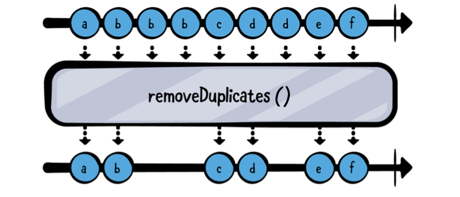

이 연산자에 아무런 인수를 제공할 필요가 없다는 점을 주목하세요! removeDuplicates는 String을 포함하여 Equatable을 준수하는 모든 값에 대해 자동으로 작동합니다.

```
example(of: "removeDuplicates") {
  // 1
  let words = "hey hey there! want to listen to mister mister ?"
                  .components(separatedBy: " ")
                  .publisher
  // 2
  words
    .removeDuplicates()
    .sink(receiveValue: { print($0) })
    .store(in: &subscriptions)
}
```

이 코드는 이전 코드와 크게 다르지 않습니다. 여러분은:

문장을 단어 배열(Array<String>)로 분리한 다음, 이 단어들을 방출할 새로운 퍼블리셔를 생성합니다.

words 퍼블리셔에 removeDuplicates()를 적용합니다.
```
——— Example of: removeDuplicates ———
hey
there!
want
to
listen
to
mister
?
```
보시다시피, 두 번째 "hey"와 두 번째 "mister"를 건너뛰었습니다. 
 
  **참고**: Equatable을 준수하지 않는 값은 어떻게 할까요? removeDuplicates는 두 값을 가진 클로저를 받아 이 값들이 동일한지 여부를 나타내는 Bool 값을 반환하는 또 다른 오버로드를 가지고 있습니다.

# Compacting and ignoring
자주 Optional 값을 방출하는 퍼블리셔를 다루게 될 것입니다. 또는 더 일반적으로, 어떤 작업을 수행하다가 nil을 반환할 수 있는 상황이 있을 겁니다. 하지만 그 모든 nil을 처리하고 싶지는 않을 것입니다, 그렇죠?!

만약 Swift 표준 라이브러리의 Sequence에서 이 작업을 수행하는 매우 잘 알려진 메서드인 compactMap이 생각난다면, 좋은 소식입니다 - 동일한 이름의 연산자도 있습니다!

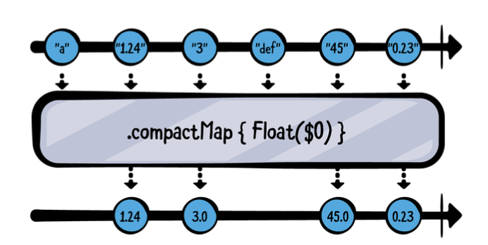

```
example(of: "compactMap") {
  // 1
  let strings = ["a", "1.24", "3",
                 "def", "45", "0.23"].publisher
  // 2
  strings
    .compactMap { Float($0) }
    .sink(receiveValue: {
      // 3
      print($0)
    })
    .store(in: &subscriptions)
}
```

다이어그램에서 설명한 것처럼, 여러분은:

유한한 문자열 목록을 방출하는 퍼블리셔를 생성합니다.

compactMap을 사용하여 각 개별 문자열에서 Float를 초기화하려고 시도합니다. Float의 초기화 함수가 제공된 문자열을 변환할 수 없는 경우 nil을 반환합니다.

성공적으로 Float로 변환된 문자열만 출력합니다.

```
——— Example of: compactMap ———
1.24
3.0
45.0
0.23
```

좋아요, 잠시 이 모든 값에서 벗어나 봅시다... 사실, 그 값들이 뭐가 중요하겠어요, 그렇죠? 때때로 여러분이 알고 싶은 것은 퍼블리셔가 값을 방출하는 것을 완료했다는 것뿐이고, 실제 값은 무시해도 될 때가 있습니다. 이러한 상황이 발생할 때는 ignoreOutput 연산자를 사용할 수 있습니다:

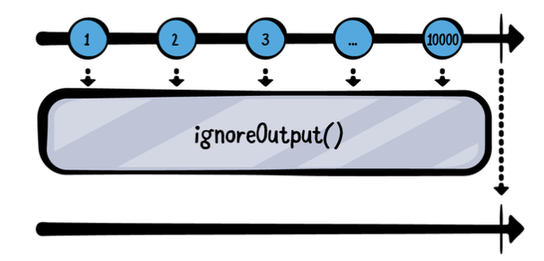

위 다이어그램에서 보여주듯이, 방출되는 값이 무엇이든, 얼마나 많이 방출되든 상관없이 모두 무시됩니다. 오직 완료 이벤트만 소비자에게 전달됩니다.

```
example(of: "ignoreOutput") {
  // 1
  let numbers = (1...10_000).publisher
  // 2
  numbers
    .ignoreOutput()
    .sink(receiveCompletion: { print("Completed with: \($0)") },
          receiveValue: { print($0) })
    .store(in: &subscriptions)
}
```
위 예제에서 여러분은:

1부터 10,000까지 10,000개의 값을 방출하는 퍼블리셔를 생성합니다.
ignoreOutput 연산자를 추가하여 모든 값을 생략하고 완료 이벤트만 소비자에게 전달합니다.
이 코드의 출력이 무엇일지 추측할 수 있나요?
아무 값도 출력되지 않을 것이라고 추측했다면, 정답입니다! 플레이그라운드를 실행하고 디버그 콘솔을 확인해보세요.

```
——— Example of: ignoreOutput ———
Completed with: finished
```

# Finding values
이번 섹션에서는 Swift 표준 라이브러리에서 유래된 두 가지 연산자인 first(where:)와 last(where:)에 대해 배울 것입니다. 이름에서 알 수 있듯이, 이 연산자들은 제공된 조건과 일치하는 첫 번째 또는 마지막 값을 찾아서 방출하는 데 사용됩니다.

몇 가지 예제를 살펴볼 시간입니다. 먼저, first(where:)부터 시작해보겠습니다.
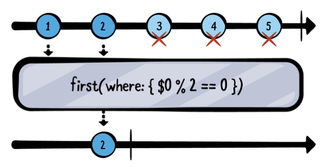

이 연산자는 게으르다는 점에서 흥미롭습니다. 즉, 제공된 조건과 일치하는 값을 찾을 때까지 필요한 만큼의 값만 취합니다. 일치하는 값을 찾으면 즉시 구독을 취소하고 완료합니다.
이 코드가 어떻게 작동하는지 보려면 다음 코드를 플레이그라운드에 추가하세요

```
example(of: "first(where:)") {
  // 1
  let numbers = (1...9).publisher
  // 2
  numbers
    .first(where: { $0 % 2 == 0 })
    .sink(receiveCompletion: { print("Completed with: \($0)") },
          receiveValue: { print($0) })
    .store(in: &subscriptions)
}
```
방금 추가한 코드의 동작은 다음과 같습니다:

1부터 9까지의 숫자를 방출하는 새로운 퍼블리셔를 생성합니다.
first(where:) 연산자를 사용하여 처음으로 방출된 짝수를 찾습니다.
이 예제를 플레이그라운드에서 실행하고 콘솔 출력을 확인하세요:

```
——— Example of: first(where:) ———
2
Completed with: finished
```
예상대로 정확히 작동합니다. 하지만 상류 퍼블리셔, 즉 numbers 퍼블리셔에 대한 구독은 어떨까요? 짝수를 찾은 후에도 계속 값을 방출할까요? 이 이론을 테스트하려면 다음 줄을 찾아보세요:
```
numbers
```
그런 다음 그 줄 바로 다음에 print("numbers") 연산자를 추가하여 다음과 같이 보이게 하세요:
```
numbers
  .print("numbers")
```

참고: 연산자 체인의 어디에서든 print 연산자를 사용하여 해당 지점에서 발생하는 이벤트를 정확히 확인할 수 있습니다.

플레이그라운드를 다시 실행하고 출력 결과를 확인해 보세요. 출력 결과는 다음과 비슷할 것입니다:
```
——— Example of: first(where:) ———
numbers: receive subscription: (1...9)
numbers: request unlimited
numbers: receive value: (1)
numbers: receive value: (2)
2
numbers: receive cancel
Completed with: finished
```
매우 흥미롭습니다!

보시다시피, first(where:)가 일치하는 값을 찾자마자 구독을 통해 취소 요청을 보내고, 이로 인해 상류 퍼블리셔는 값을 방출하는 것을 중단합니다. 매우 유용하죠!

이제 이 연산자의 반대인 last(where:)로 넘어가겠습니다. 이 연산자는 제공된 조건과 일치하는 마지막 값을 찾는 역할을 합니다.

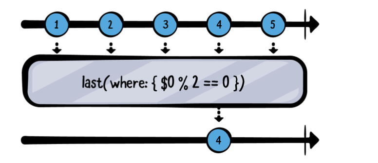

first(where:)와는 달리, 이 연산자는 제공된 조건과 일치하는 값을 찾기 위해 모든 값이 방출될 때까지 기다려야 하므로 탐욕적(greedy)입니다. 따라서 상류 퍼블리셔는 어떤 시점에서 완료되어야 합니다.
플레이그라운드에 다음 코드를 추가하세요:
```
example(of: "last(where:)") {
  // 1
  let numbers = (1...9).publisher
  // 2
  numbers
    .last(where: { $0 % 2 == 0 })
    .sink(receiveCompletion: { print("Completed with: \($0)") },
          receiveValue: { print($0) })
    .store(in: &subscriptions)
}
```
이전 코드 예제와 마찬가지로:

1부터 9까지의 숫자를 방출하는 퍼블리셔를 생성합니다.
last(where:) 연산자를 사용하여 마지막으로 방출된 짝수를 찾습니다.
출력이 어떻게 될지 추측해 보세요. 플레이그라운드를 실행하고 확인해 보세요:
```
——— Example of: last(where:) ———
8
Completed with: finished
```

이 연산자가 작동하려면 퍼블리셔가 완료되어야 한다고 이전에 말했던 것을 기억하시나요? 그 이유는 무엇일까요? 이는 연산자가 퍼블리셔가 나중에 조건과 일치하는 값을 방출할지 알 수 없기 때문입니다. 따라서 연산자는 조건과 일치하는 마지막 항목을 결정하기 전에 퍼블리셔의 전체 범위를 알아야 합니다.
이를 실제로 확인하기 위해 전체 예제를 다음 코드로 대체하세요:
```
example(of: "last(where:)") {
  let numbers = PassthroughSubject<Int, Never>()
  numbers
    .last(where: { $0 % 2 == 0 })
    .sink(receiveCompletion: { print("Completed with: \($0)") },
          receiveValue: { print($0) })
    .store(in: &subscriptions)
  numbers.send(1)
  numbers.send(2)
  numbers.send(3)
  numbers.send(4)
  numbers.send(5)
}
```

이 예제에서는 PassthroughSubject를 사용하여 이벤트를 수동으로 전송합니다.
플레이그라운드를 다시 실행하면 아무것도 출력되지 않는 것을 볼 수 있습니다:
```
——— Example of: last(where:) ———
```
예상대로 퍼블리셔가 완료되지 않았기 때문에 조건에 일치하는 마지막 값을 결정할 수 없습니다.

이를 해결하기 위해, 예제의 마지막 줄에 다음 코드를 추가하여 주제를 통해 완료를 전송하세요:
```
numbers.send(completion: .finished)
```
플레이그라운드를 다시 실행하면 이제 모든 것이 예상대로 작동할 것입니다:
```
——— Example of: last(where:) ———
4
Completed with: finished
```
완성된 코드는 다음과 같습니다:
```
example(of: "last(where:)") {
  let numbers = PassthroughSubject<Int, Never>()
  numbers
    .last(where: { $0 % 2 == 0 })
    .sink(receiveCompletion: { print("Completed with: \($0)") },
          receiveValue: { print($0) })
    .store(in: &subscriptions)
  numbers.send(1)
  numbers.send(2)
  numbers.send(3)
  numbers.send(4)
  numbers.send(5)
  numbers.send(completion: .finished)
}
```
이제 last(where:) 연산자가 조건에 일치하는 마지막 값을 찾고, 퍼블리셔가 완료되었음을 확인할 수 있습니다.

# Dropping values
값을 드롭하는 기능은 퍼블리셔를 다룰 때 자주 활용해야 하는 유용한 기능입니다. 예를 들어, 하나의 퍼블리셔에서 값을 무시하다가 두 번째 퍼블리셔가 발행을 시작할 때까지 기다리거나, 스트림의 시작 부분에서 특정 수의 값을 무시하고 싶을 때 사용할 수 있습니다.
이 범주에 속하는 세 가지 연산자가 있으며, 가장 간단한 것부터 시작하여 배우게 될 것입니다 — dropFirst.
dropFirst 연산자는 count 매개변수를 받아들이며, 생략된 경우 기본값은 1입니다. 퍼블리셔가 방출하는 처음 count 개의 값을 무시하고, count 값이 방출된 후에야 값을 통과시킵니다.

플레이그라운드에 다음 코드를 추가하여 dropFirst 연산자가 어떻게 작동하는지 확인해 보세요:
```
example(of: "dropFirst") {
  // 1
  let numbers = (1...10).publisher
  // 2
  numbers
    .dropFirst(8)
    .sink(receiveCompletion: { print("Completed with: \($0)") },
          receiveValue: { print($0) })
    .store(in: &subscriptions)
}
```
이전 다이어그램처럼 다음과 같이 합니다:

1부터 10까지 10개의 숫자를 방출하는 퍼블리셔를 생성합니다.
dropFirst(8)을 사용하여 처음 8개의 값을 무시하고, 9와 10만 출력합니다.
플레이그라운드를 실행하면 다음과 같은 출력을 확인할 수 있습니다:
```
——— Example of: dropFirst ———
9
10
Completed with: finished
```

간단하죠? 종종 가장 유용한 연산자는 이런 간단한 것들입니다!

# Dropping values

다음 값 드롭 연산자는 drop(while:)입니다. 이 연산자는 조건 클로저를 받아, 조건이 처음으로 충족될 때까지 퍼블리셔가 방출하는 모든 값을 무시합니다. 조건이 충족되는 즉시 값들이 연산자를 통해 흐르기 시작합니다.

플레이그라운드에 다음 예제를 추가하여 drop(while:) 연산자가 어떻게 작동하는지 확인해 보세요:

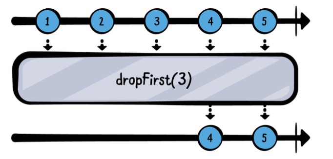

```
example(of: "drop(while:)") {
  // 1
  let numbers = (1...10).publisher
  // 2
  numbers
    .drop(while: { $0 % 5 != 0 })
    .sink(receiveValue: { print($0) })
    .store(in: &subscriptions)
}
```

위 코드에서:

1부터 10까지의 값을 방출하는 퍼블리셔를 생성합니다.
drop(while:) 연산자를 사용하여 값이 5의 배수가 아닐 동안 방출되는 모든 값을 무시하고, 값이 5의 배수가 되는 순간부터 값을 통과시킵니다.
이 예제를 플레이그라운드에서 실행하고 콘솔 출력을 확인하세요:
```
——— Example of: drop(while:) ———
5
6
7
8
9
10
```
훌륭합니다! 보시다시피, 처음 네 개의 값을 건너뛰었습니다. 5가 도착하자마자 "이 값이 5로 나누어떨어지나요?"라는 질문이 마침내 참이 되어 5와 이후의 모든 값을 방출합니다.

여기서 궁금해질 수 있습니다 – 이 연산자는 filter와 어떻게 다를까요? 둘 다 클로저를 사용하여 그 결과에 따라 어떤 값을 방출할지 제어합니다.
첫 번째 차이점은 filter는 클로저에서 true를 반환하면 값을 통과시키는 반면, drop(while:)는 클로저에서 true를 반환하는 동안 값을 건너뜁니다.

두 번째, 그리고 더 중요한 차이점은 filter는 상류 퍼블리셔가 발행한 모든 값에 대해 조건을 평가하는 것을 멈추지 않는다는 것입니다. filter의 조건이 참으로 평가된 후에도 이후 값들은 여전히 "질문"을 받고, 클로저는 "이 값을 통과시킬 것인가?"라는 질문에 답해야 합니다.

맞습니다. drop(while:)의 조건 클로저는 조건이 충족된 후에는 다시 실행되지 않습니다. 이를 확인하려면 다음 줄을 교체하세요:
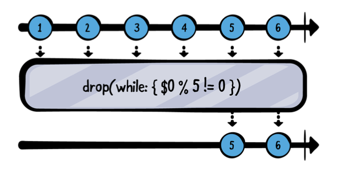
```
.drop(while: { $0 % 5 != 0 })
```

다음 코드로 바꿉니다:
```
.drop(while: {
  print("x")
  return $0 % 5 != 0
})
```
클로저가 호출될 때마다 디버그 콘솔에 x를 출력하는 print 문을 추가했습니다. 플레이그라운드를 실행하면 다음과 같은 출력을 확인할 수 있습니다:

```
——— Example of: drop(while:) ———
x
x
x
x
x
5
6
7
8
9
10
```
맞아요, x가 정확히 다섯 번 출력됩니다. 조건이 충족되자마자(5가 방출될 때) 클로저는 더 이상 평가되지 않습니다.

이제 두 개의 드롭 연산자를 다루었고, 하나가 더 남았습니다. 필터링 범주의 마지막이자 가장 정교한 연산자는 drop(untilOutputFrom:)입니다.

다음과 같은 시나리오를 상상해보세요. 사용자가 버튼을 탭하고 있지만, isReady 퍼블리셔가 어떤 결과를 방출할 때까지 모든 탭을 무시하고 싶습니다. 이 연산자는 이러한 조건에 완벽하게 맞습니다.
이 연산자는 두 번째 퍼블리셔가 값을 방출하기 시작할 때까지 첫 번째 퍼블리셔가 방출하는 모든 값을 건너뛰며, 이들 사이에 관계를 만듭니다.

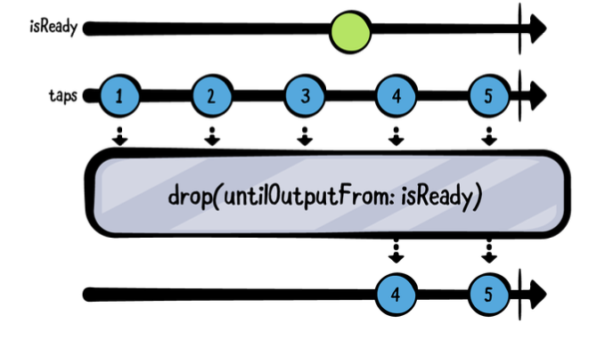

플레이그라운드에 다음 예제를 추가하여 drop(untilOutputFrom:) 연산자가 어떻게 작동하는지 확인해 보세요:

맨 위 줄은 isReady 스트림을 나타내고, 두 번째 줄은 isReady를 인수로 받는 drop(untilOutputFrom:)을 통과하는 사용자의 탭을 나타냅니다.
플레이그라운드 끝에 이 다이어그램을 재현하는 다음 코드를 추가하세요:
```
example(of: "drop(untilOutputFrom:)") {
  // 1
  let isReady = PassthroughSubject<Void, Never>()
  let taps = PassthroughSubject<Int, Never>()
  
  // 2
  taps
    .drop(untilOutputFrom: isReady)
    .sink(receiveValue: { print($0) })
    .store(in: &subscriptions)
  
  // 3
  (1...5).forEach { n in
    taps.send(n)
    if n == 3 {
      isReady.send()
    }
  }
}
```
이 코드에서:

1. 값을 수동으로 전송할 수 있는 두 개의 PassthroughSubject를 생성합니다. 첫 번째는 isReady, 두 번째는 사용자의 탭을 나타내는 taps입니다.
2. drop(untilOutputFrom: isReady)를 사용하여 isReady가 적어도 하나의 값을 방출할 때까지 사용자의 모든 탭을 무시합니다.
3. 다이어그램과 같이 taps를 통해 다섯 번의 "탭"을 전송합니다. 세 번째 탭 후에 isReady에 값을 전송합니다.

플레이그라운드를 실행하고 디버그 콘솔 출력을 확인하세요. 다음과 같은 출력을 볼 수 있습니다:
```
——— Example of: drop(untilOutputFrom:) ———
4
5
```

출력 결과는 위의 다이어그램과 같습니다:

사용자의 다섯 번의 탭 중 처음 세 번은 무시됩니다.
세 번째 탭 이후에 isReady가 값을 방출합니다.
이후 사용자의 모든 탭은 통과됩니다.
이제 원하지 않는 값을 제거하는 방법을 잘 이해하게 되었습니다! 이제 마지막 필터링 연산자 그룹인 "값 제한"에 대해 알아볼 시간입니다.

# Limiting values
이전 섹션에서는 특정 조건이 충족될 때까지 값을 드롭(또는 건너뛰기)하는 방법을 배웠습니다. 조건은 정적 값과 일치하거나, 조건 클로저 또는 다른 퍼블리셔에 대한 의존성을 가질 수 있습니다.

이 섹션에서는 반대의 필요성을 다룹니다: 특정 조건이 충족될 때까지 값을 받고, 그 후에는 퍼블리셔를 완료시키는 것입니다. 예를 들어, 알 수 없는 양의 값을 방출할 수 있는 요청이 있을 때, 단 하나의 방출만 받고 나머지는 무시하고 싶을 수 있습니다.

Combine은 이러한 문제를 prefix 연산자 군을 사용하여 해결합니다. 이름이 직관적이지는 않지만, 이 연산자들이 제공하는 기능은 많은 실제 상황에서 유용합니다.

prefix 연산자 군은 drop 연산자 군과 유사하며, prefix(_:), prefix(while:), prefix(untilOutputFrom:)를 제공합니다. 그러나 특정 조건이 충족될 때까지 값을 드롭하는 대신, prefix 연산자는 조건이 충족될 때까지 값을 받습니다.

이제, 이 장의 마지막 연산자 세트인 prefix 연산자에 대해 알아볼 시간입니다. 먼저 prefix(_:)부터 시작해 보겠습니다.

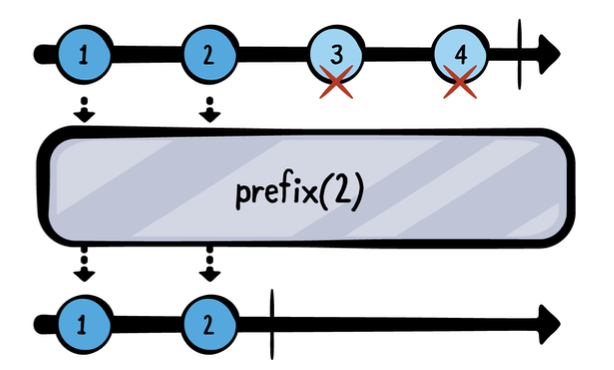

플레이그라운드에 다음 예제를 추가하여 prefix(_:) 연산자가 어떻게 작동하는지 확인해 보세요:
```
example(of: "prefix") {
  // 1
  let numbers = (1...10).publisher
  // 2
  numbers
    .prefix(2)
    .sink(receiveCompletion: { print("Completed with: \($0)") },
          receiveValue: { print($0) })
    .store(in: &subscriptions)
}
```
이 코드는 이전 섹션에서 사용한 drop 코드와 매우 유사합니다. 여러분은:

1부터 10까지의 숫자를 방출하는 퍼블리셔를 생성합니다.
prefix(2)를 사용하여 처음 두 개의 값만 방출하도록 합니다. 두 값이 방출되면 퍼블리셔는 완료됩니다.
플레이그라운드를 실행하면 다음과 같은 출력을 볼 수 있습니다:
```
——— Example of: prefix ———
1
2
Completed with: finished
```

이 연산자는 first(where:)와 마찬가지로 게으르게 동작하여 필요한 값만 받고 종료합니다. 이는 numbers 퍼블리셔가 1과 2 이외의 추가 값을 생성하지 않도록 합니다.

다음으로 prefix(while:)를 살펴보겠습니다. 이 연산자는 조건 클로저를 받아 클로저의 결과가 true인 동안 상류 퍼블리셔의 값을 통과시킵니다. 결과가 false가 되면 퍼블리셔는 완료됩니다.

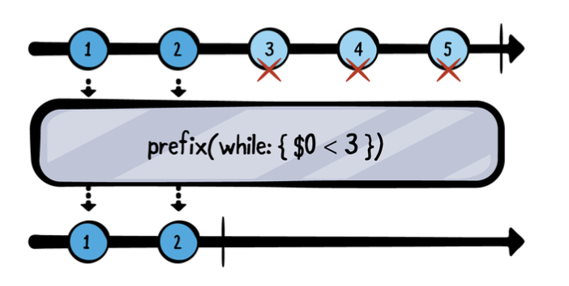

플레이그라운드에 다음 예제를 추가하여 prefix(while:) 연산자가 어떻게 작동하는지 확인해 보세요:

```
example(of: "prefix(while:)") {
  // 1
  let numbers = (1...10).publisher
  // 2
  numbers
    .prefix(while: { $0 < 3 })
    .sink(receiveCompletion: { print("Completed with: \($0)") },
          receiveValue: { print($0) })
    .store(in: &subscriptions)
}
```

이 예제는 이전 예제와 거의 동일하며, 접두 조건을 평가하기 위해 클로저를 사용하는 점만 다릅니다. 여러분은:

1. 1부터 10까지의 값을 방출하는 퍼블리셔를 생성합니다.
2. prefix(while:)를 사용하여 값이 3보다 작은 동안 값을 통과시킵니다. 3 이상의 값이 방출되면 퍼블리셔는 완료됩니다.

플레이그라운드를 실행하고 디버그 콘솔을 확인하세요. 출력 결과는 이전 연산자와 동일해야 합니다:
```
——— Example of: prefix(while:) ———
1
2
Completed with: finished
```
이제 첫 두 개의 접두 연산자를 살펴봤으니, 가장 복잡한 연산자인 prefix(untilOutputFrom:)을 살펴볼 차례입니다. drop(untilOutputFrom:)이 두 번째 퍼블리셔가 값을 방출할 때까지 값을 건너뛰는 반면, prefix(untilOutputFrom:)은 두 번째 퍼블리셔가 값을 방출할 때까지 값을 받아들입니다.

사용자가 버튼을 두 번만 탭할 수 있는 시나리오를 상상해 보세요. 두 번의 탭이 발생하자마자 버튼에 대한 추가 탭 이벤트는 무시되어야 합니다.

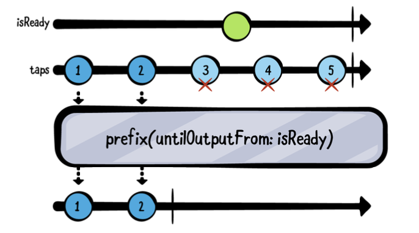

플레이그라운드에 다음 예제를 추가하여 prefix(untilOutputFrom:) 연산자가 어떻게 작동하는지 확인해 보세요:

```
example(of: "prefix(untilOutputFrom:)") {
  // 1
  let isReady = PassthroughSubject<Void, Never>()
  let taps = PassthroughSubject<Int, Never>()
  
  // 2
  taps
    .prefix(untilOutputFrom: isReady)
    .sink(receiveCompletion: { print("Completed with: \($0)") },
          receiveValue: { print($0) })
    .store(in: &subscriptions)
  
  // 3
  (1...5).forEach { n in
    taps.send(n)
    if n == 2 {
      isReady.send()
    }
  }
}
```

이 예제는 drop(untilOutputFrom:) 예제를 떠올리면 쉽게 이해할 수 있습니다. 여러분은:

1. 수동으로 값을 전송할 수 있는 두 개의 PassthroughSubject를 생성합니다. 첫 번째는 isReady이고, 두 번째는 사용자의 탭을 나타냅니다.
2. prefix(untilOutputFrom: isReady)를 사용하여 isReady가 적어도 하나의 값을 방출할 때까지 탭 이벤트를 통과시킵니다.
3. 다이어그램과 같이 5번의 "탭"을 주제에 전송합니다. 두 번째 탭 이후에 isReady에 값을 전송합니다.

플레이그라운드를 실행하고 디버그 콘솔 출력을 확인하세요. 다음과 같은 출력을 볼 수 있습니다:
```
——— Example of: prefix(untilOutputFrom:) ———
1
2
Completed with: finished
```


# Challenge: Filter all the things

1부터 100까지의 숫자를 방출하는 퍼블리셔를 생성하고, 필터링 연산자를 사용하여 다음을 수행하세요:

상류 퍼블리셔가 방출하는 처음 50개의 값을 건너뛰세요.
그 후의 20개의 값을 받으세요.
짝수만 받으세요.


```
example(of: "Filter all the things") {
  // 1
  let numbers = (1...100).publisher
  
  // 2
  numbers
    .dropFirst(50)                  // 처음 50개의 값을 건너뜁니다.
    .prefix(20)                     // 다음 20개의 값을 받습니다.
    .filter { $0 % 2 == 0 }         // 짝수만 받습니다.
    .sink(receiveCompletion: { print("Completed with: \($0)") },
          receiveValue: { print($0) })
    .store(in: &subscriptions)
}

```

결과값은 다음과 같습니다.

```
——— Example of: Filter all the things ———
52
54
56
58
60
62
64
66
68
70
Completed with: finished
```
