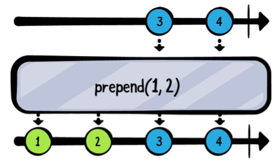
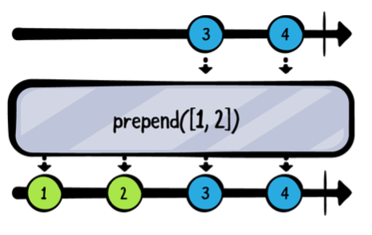
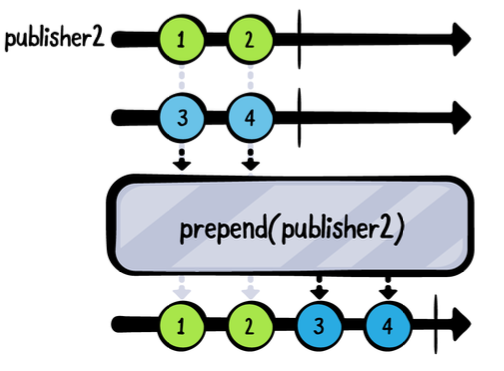
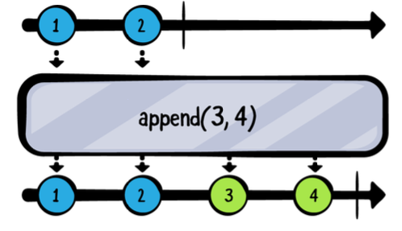
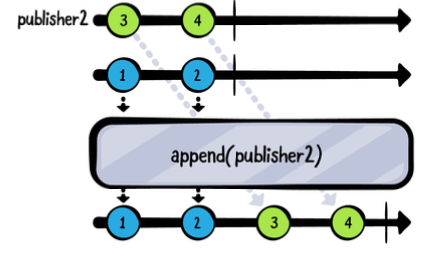
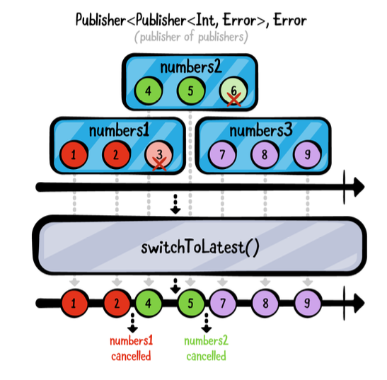
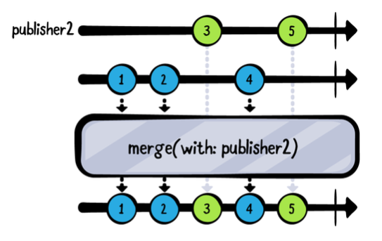
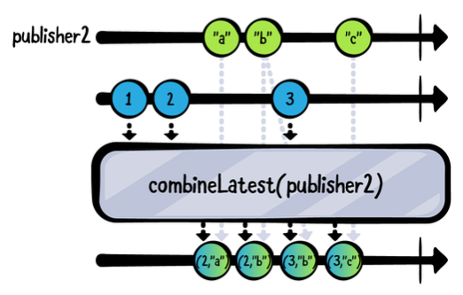
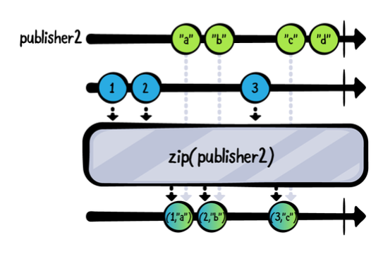

# Chapter 5: Combining Operators
**Bongjin Lee**

이제 **변환**과 **필터링** 연산자 카테고리가 여러분의 도구 상자에 들어왔으니, 상당한 양의 지식을 갖추게 되었습니다. 여러분은 연산자들이 어떻게 작동하는지, 상위 스트림을 어떻게 조작하는지, 그리고 데이터로부터 논리적인 퍼블리셔 체인을 구성하는 데 어떻게 사용하는지 배웠습니다.

이 장에서는 더 복잡하지만 매우 유용한 연산자 카테고리 중 하나인 **결합 연산자**에 대해 배우게 될 것입니다. 이 연산자 세트를 사용하면 서로 다른 퍼블리셔에서 방출된 이벤트를 결합하고 Combine 코드에서 의미 있는 데이터 조합을 만들 수 있습니다.

왜 결합이 유용할까요? 사용자로부터 여러 입력을 받는 폼을 생각해 보세요 - 사용자 이름, 비밀번호, 체크박스 등이 있을 수 있습니다. 이 데이터를 결합하여 필요한 모든 정보를 포함하는 단일 퍼블리셔를 구성해야 할 것입니다.

각 연산자가 어떻게 기능하는지, 그리고 여러분의 요구에 맞는 적절한 연산자를 어떻게 선택하는지 더 많이 배우게 되면, 여러분의 코드는 더욱 일관성 있게 될 것입니다.? 

### Getting started
이 장의 시작 플레이그라운드는 projects/ Starter.playground 폴더에서 찾을 수 있습니다. 이 장을 통해 플레이그라운드에 코드를 추가하고 실행하여 다양한 연산자가 퍼블리셔와 이벤트의 서로 다른 조합을 어떻게 만드는지 볼 수 있습니다.

### 선행 추가(Prepending)
퍼블리셔의 시작 부분에 값을 추가하는 연산자 그룹부터 천천히 시작하겠습니다. 다시 말해, 원래 퍼블리셔의 값들이 방출되기 전에 방출될 값들을 추가하는 데 사용할 것입니다.
이 섹션에서는 prepend(Output...), prepend(Sequence), prepend(Publisher)에 대해 배웁니다.

### prepend(Output...)
prepend의 이 변형은 가변 인자 ... 구문을 사용하여 가변 값 목록을 받습니다. 이는 원래 퍼블리셔와 동일한 Output 타입이라면 여러 개의 값을 받을 수 있다는 의미입니다.



```
example(of: "prepend(Output...)") {
  // 1
  let publisher = [3, 4].publisher
// 2
  publisher
    .prepend(1, 2)
    .sink(receiveValue: { print($0) })
    .store(in: &subscriptions)
}
```

위 코드에서는:
숫자 3과 4를 방출하는 퍼블리셔를 만듭니다.
prepend를 사용하여 퍼블리셔의 자체 값 앞에 숫자 1과 2를 추가합니다.
플레이그라운드를 실행하세요. 디버그 콘솔에 다음과 같이 표시되어야 합니다:
```
——— Example of: prepend(Output...) ———
1
2
3
4
```

매우 간단합니다! 잠깐, 연산자들이 연결 가능하다는 걸 기억하시나요? 원한다면 여러 개의 prepend를 쉽게 추가할 수 있다는 뜻입니다. 다음 줄 아래에:
```
.prepend(1, 2)
```
다음을 추가하세요:
```
.prepend(-1, 0)
```
플레이그라운드를 다시 실행하세요. 다음과 같은 출력이 표시되어야 합니다:
```
——— Example of: prepend(Output...) ———
-1
0
1
2
3
4
```
여기서 연산 순서가 중요하다는 점에 주목하세요. 마지막 prepend가 상류에 먼저 영향을 미치므로, -1과 0이 먼저 추가되고, 그 다음 1과 2가 추가되며, 마지막으로 원래 퍼블리셔의 값들이 방출됩니다.

### prepend(Sequence)
이 prepend 변형은 이전 것과 비슷하지만, 입력으로 Sequence를 준수하는 객체를 받는다는 점이 다릅니다. 예를 들어, Array나 Set을 받을 수 있습니다.



이 연산자를 실험해보기 위해 플레이그라운드에 다음 코드를 추가하세요:
```
example(of: "prepend(Sequence)") {
  // 1
  let publisher = [5, 6, 7].publisher

  // 2
  publisher
    .prepend([3, 4])
    .prepend(Set(1...2))
    .sink(receiveValue: { print($0) })
    .store(in: &subscriptions)
}
```
위의 코드에서는:

숫자 5, 6, 7을 방출하는 퍼블리셔를 만듭니다.
원래 퍼블리셔에 prepend(Sequence)를 두 번 연결합니다. 한 번은 Array의 값을 추가하고, 두 번째는 Set의 값을 추가합니다.

플레이그라운드를 실행하세요. 출력은 다음과 유사해야 합니다:
```
——— Example of: prepend(Sequence) ———
1
2
3
4
5
6
7
```

```
참고: Array와 달리 Set은 순서가 없다는 중요한 사실을 기억해야 합니다. 따라서 항목이 방출되는 순서가 보장되지 않습니다. 이는 위 예제의 첫 두 값이 1과 2 또는 2와 1이 될 수 있다는 것을 의미합니다.
```

하지만 더 있습니다! Swift에서는 많은 타입들이 Sequence를 준수하므로 흥미로운 작업을 할 수 있습니다.
두 번째 prepend 뒤에:
```
.prepend(Set(1...2))
```
다음 줄을 추가하세요:
```
.prepend(stride(from: 6, to: 11, by: 2))
```
이 코드 줄에서는 6에서 11 사이를 2씩 보폭으로 이동하는 Strideable을 만듭니다. Strideable이 Sequence를 준수하므로 prepend(Sequence)에서 사용할 수 있습니다.
플레이그라운드를 한 번 더 실행하고 디버그 콘솔을 확인해보세요:
```
——— Example of: prepend(Sequence) ———
6
8
10
1
2
3
4
5
6
7
```
보시다시피, 이전 출력 앞에 세 개의 새로운 값이 퍼블리셔에 추가되었습니다 - 6, 8, 10이며, 이는 6에서 11 사이를 2씩 보폭으로 이동한 결과입니다.
### prepend(Publisher)
이전의 두 연산자는 기존 퍼블리셔에 값 목록을 추가했습니다. 하지만 두 개의 서로 다른 퍼블리셔가 있고 그 값들을 함께 연결하고 싶다면 어떻게 할까요? prepend(Publisher)를 사용하여 원래 퍼블리셔의 값 앞에 두 번째 퍼블리셔에서 방출된 값을 추가할 수 있습니다.



위의 예제를 시도해보려면 플레이그라운드에 다음을 추가하세요:
```
example(of: "prepend(Publisher)") {
  // 1
  let publisher1 = [3, 4].publisher
  let publisher2 = [1, 2].publisher

  // 2
  publisher1
    .prepend(publisher2)
    .sink(receiveValue: { print($0) })
    .store(in: &subscriptions)
}
```

이 코드에서는:

1. 두 개의 퍼블리셔를 생성합니다. 하나는 숫자 3과 4를 방출하고, 다른 하나는 1과 2를 방출합니다.
2. publisher1의 시작 부분에 publisher2를 선행 추가합니다. publisher1의 값들은 publisher2가 완료된 후에만 방출됩니다.

플레이그라운드를 실행하면 디버그 콘솔에 다음과 같은 출력이 표시되어야 합니다:
```
——— Example of: prepend(Publisher) ———
1
2
3
4
```
예상대로 publisher2에서 값 1과 2가 먼저 방출되고, 그 후에 publisher1에서 3과 4가 방출됩니다.
이 연산자에 대해 알아야 할 한 가지 세부 사항이 더 있는데, 예제로 보여드리는 것이 가장 쉬울 것 같습니다.
플레이그라운드 끝에 다음을 추가하세요:
```
example(of: "prepend(Publisher) #2") {
  // 1
  let publisher1 = [3, 4].publisher
  let publisher2 = PassthroughSubject<Int, Never>()

  // 2
  publisher1
    .prepend(publisher2)
    .sink(receiveValue: { print($0) })
    .store(in: &subscriptions)

  // 3
  publisher2.send(1)
  publisher2.send(2)
}
```
이 예제는 이전 것과 비슷하지만, publisher2가 이제 수동으로 값을 전달할 수 있는 PassthroughSubject라는 점이 다릅니다.
다음 예제에서는:

1. 두 개의 퍼블리셔를 생성합니다. 첫 번째는 값 3과 4를 방출하고, 두 번째는 동적으로 값을 받을 수 있는 PassthroughSubject입니다.
2. publisher1 앞에 subject를 선행 추가합니다.
3. subject publisher2를 통해 값 1과 2를 전송합니다.

잠시 시간을 내어 이 코드를 머릿속으로 실행해보세요. 어떤 출력이 나올 것으로 예상하시나요?
이제 플레이그라운드를 다시 실행하고 디버그 콘솔을 확인해보세요. 다음과 같이 표시되어야 합니다:
```
——— Example of: prepend(Publisher) #2 ———
1
2
```

잠깐, 뭔가요? 왜 publisher2에서 두 개의 숫자만 방출되었을까요? 아마도 이렇게 생각하실 겁니다... "이봐요, Shai, 방금 값들이 기존 퍼블리셔에 선행 추가된다고 하지 않았나요?"
자, 생각해 보세요 - Combine이 어떻게 선행 추가된 퍼블리셔인 publisher2가 값 방출을 끝냈다는 것을 알 수 있을까요? 알 수 없습니다. 왜냐하면 값은 방출되었지만, 완료 이벤트가 없기 때문입니다. 이러한 이유로, 선행 추가된 퍼블리셔는 반드시 완료되어야 Combine이 선행 추가가 끝났음을 알고 주 퍼블리셔로 진행할 수 있습니다.
다음 줄 뒤에:
```
publisher2.send(2)
```
이 줄을 추가하세요:
```
publisher2.send(completion: .finished)
```
Combine은 이제 publisher2가 작업을 완료했기 때문에 publisher1에서의 방출을 처리할 수 있다는 것을 알게 됩니다.
플레이그라운드를 다시 실행해보세요. 이번에는 예상한 출력값을 볼 수 있을 것입니다:
```
——— Example of: prepend(Publisher) #2 ———
1
2
3
4
```
### Appending
다음 연산자 세트는 퍼블리셔가 방출한 이벤트를 다른 값들과 연결하는 작업을 다룹니다. 하지만 이 경우에는 prepend가 아닌 append를 사용하게 됩니다. append(Output...), append(Sequence), append(Publisher)를 사용합니다. 이 연산자들은 prepend 연산자와 유사한 방식으로 작동합니다.
### append(Output...)
append(Output...)는 prepend와 유사하게 작동합니다: 타입 Output의 가변 인자 리스트를 받아 원래 퍼블리셔가 .finished 이벤트로 완료된 후에 이 항목들을 추가합니다.



다음 코드를 플레이그라운드에 추가하여 이 연산자를 실험해보세요:
```
example(of: "append(Output...)") {
  // 1
  let publisher = [1].publisher
  // 2
  publisher
    .append(2, 3)
    .append(4)
    .sink(receiveValue: { print($0) })
    .store(in: &subscriptions)
}
```
위 코드에서 당신은:

1. 오직 단일 값 1만을 방출하는 퍼블리셔를 생성합니다.
2. append를 두 번 사용하여 먼저 2와 3을 추가하고, 그 다음에 4를 추가합니다.

이 코드를 잠시 생각해보세요 — 출력값이 어떻게 나올 것 같나요?
플레이그라운드를 실행하여 출력을 확인해보세요:
```
——— Example of: append(Output...) ———
1
2
3
4
```
append는 예상한 대로 작동합니다. 각각의 append는 상류 퍼블리셔가 완료되기를 기다린 후 자신의 작업을 추가합니다.
이 말은 상류 퍼블리셔가 **완료되어야** 하며, 그렇지 않으면 추가 작업이 일어나지 않게 됩니다. Combine은 이전 퍼블리셔가 모든 값을 방출했는지 알 수 없기 때문입니다.
이 동작을 확인하기 위해 다음 예제를 추가해보세요:

```
example(of: "append(Output...) #2") {
  // 1
  let publisher = PassthroughSubject<Int, Never>()
  publisher
    .append(3, 4)
    .append(5)
    .sink(receiveValue: { print($0) })
    .store(in: &subscriptions)
// 2
  publisher.send(1)
  publisher.send(2)
}
```

이 예제는 이전 예제와 동일하지만 두 가지 차이점이 있습니다:

1. publisher가 이제 값을 수동으로 보낼 수 있는 PassthroughSubject로 변경되었습니다.
2. PassthroughSubject에 1과 2를 보냅니다.

플레이그라운드를 다시 실행하면, publisher에 보낸 값만 방출되는 것을 볼 수 있습니다:
```
——— Example of: append(Output...) ———
1
2
```
두 개의 append 연산자는 publisher가 완료되기 전까지는 작동할 수 없기 때문에 아무런 효과가 없습니다. 예제의 맨 끝에 다음 줄을 추가하세요:
```
publisher.send(completion: .finished)
```
플레이그라운드를 다시 실행하면 예상대로 모든 값이 출력되는 것을 볼 수 있습니다:
```
——— Example of: append(Output...) #2 ———
1
2
3
4
5
```
이 동작은 모든 append 연산자 가족에 적용됩니다; 원래 퍼블리셔가 완료 이벤트를 보내지 않으면 추가 작업이 발생하지 않습니다.

### append(Sequence)
이 append의 변형은 Sequence를 준수하는 모든 객체를 받아 원래 퍼블리셔의 모든 값이 방출된 후에 해당 값을 추가합니다.


다음 코드를 플레이그라운드에 추가하여 이 연산자를 실험해보세요:
```
example(of: "append(Sequence)") {
  // 1
  let publisher = [1, 2, 3].publisher
  publisher
    .append([4, 5]) // 2
    .append(Set([6, 7])) // 3
    .append(stride(from: 8, to: 11, by: 2)) // 4
    .sink(receiveValue: { print($0) })
    .store(in: &subscriptions)
}
```
이 코드는 이전 섹션의 prepend(Sequence) 예제와 유사합니다. 당신은:

1. 1, 2, 3을 방출하는 퍼블리셔를 생성합니다.
2. 값 4와 5가 있는 배열을 추가합니다 (순서대로).
3. 값 6과 7이 있는 집합을 추가합니다 (무순서).
4. 8에서 11까지 2씩 증가하는 값을 갖는 Strideable을 추가합니다.

플레이그라운드를 실행하면 다음과 같은 출력을 볼 수 있습니다:
```
——— Example of: append(Sequence) ———
1 // 1
2
3
4 // 2
5
7 // 3
6
8 // 4
10
```
보시다시피, append의 실행은 순차적입니다. 이전 퍼블리셔가 완료되어야 다음 append가 수행됩니다. 집합 6과 7의 순서는 무작위이므로 다른 순서로 출력될 수 있습니다.

### append(Publisher)
append 연산자 그룹의 마지막 멤버는 Publisher를 받아 원래 퍼블리셔가 완료된 후 해당 퍼블리셔가 방출하는 값을 끝에 추가합니다.



이 예제를 시도하려면, 다음 코드를 플레이그라운드에 추가하세요:
```
example(of: "append(Publisher)") {
  // 1
  let publisher1 = [1, 2].publisher
  let publisher2 = [3, 4].publisher

  // 2
  publisher1
    .append(publisher2)
    .sink(receiveValue: { print($0) })
    .store(in: &subscriptions)
}
```
이 코드에서 당신은:

1. 첫 번째 퍼블리셔는 1과 2를 방출하고, 두 번째 퍼블리셔는 3과 4를 방출하는 두 개의 퍼블리셔를 생성합니다.
2. publisher1에 publisher2를 추가하여, publisher1이 완료된 후 publisher2의 모든 값이 publisher1의 끝에 추가되도록 합니다.

플레이그라운드를 실행하면 다음과 같은 출력을 볼 수 있습니다:
```
——— Example of: append(Publisher) ———
1
2
3
4
```
### Advanced combining
이제 값, 시퀀스, 심지어 전체 퍼블리셔를 추가 및 삽입하는 방법을 모두 알게 되었습니다.
다음 섹션에서는 서로 다른 퍼블리셔를 결합하는 것과 관련된 좀 더 복잡한 연산자들을 살펴보겠습니다. 비록 이 연산자들이 비교적 복잡하지만, 퍼블리셔 구성에 있어 매우 유용합니다. 이들이 어떻게 작동하는지 익히는 데 시간을 투자할 가치가 있습니다.

### switchToLatest
이 섹션에서는 Combine에서 가장 복잡한 결합 연산자 중 하나인 switchToLatest를 다룹니다.
농담이 아니고, switchToLatest는 복잡하지만 매우 유용합니다. 이는 대기 중인 퍼블리셔 구독을 취소하면서 최신 퍼블리셔 구독으로 전환할 수 있게 해줍니다.
이 연산자는 퍼블리셔 자체가 퍼블리셔를 방출할 때만 사용할 수 있습니다.



다음 코드를 플레이그라운드에 추가하여 switchToLatest 예제를 실험해보세요:
```
example(of: "switchToLatest") {
  // 1
  let publisher1 = PassthroughSubject<Int, Never>()
  let publisher2 = PassthroughSubject<Int, Never>()
  let publisher3 = PassthroughSubject<Int, Never>()
// 2
  let publishers = PassthroughSubject<PassthroughSubject<Int,
Never>, Never>()
// 3
  publishers
    .switchToLatest()
    .sink(receiveCompletion: { _ in print("Completed!") },
          receiveValue: { print($0) })
    .store(in: &subscriptions)
// 4
  publishers.send(publisher1)
  publisher1.send(1)
  publisher1.send(2)
// 5
  publishers.send(publisher2)
  publisher1.send(3)
  publisher2.send(4)
  publisher2.send(5)
// 6
  publishers.send(publisher3)
  publisher2.send(6)
  publisher3.send(7)
  publisher3.send(8)
  publisher3.send(9)
// 7
  publisher3.send(completion: .finished)
  publishers.send(completion: .finished)
}
```
와우, 코드가 많네요! 걱정하지 마세요, 보이는 것보다 간단합니다. 다음과 같이 나눠서 설명해드리겠습니다:

1. 정수와 에러가 없는 세 개의 PassthroughSubject를 생성합니다.
2. 다른 PassthroughSubject를 수락하는 두 번째 PassthroughSubject를 생성합니다.
예를 들어, publisher1, publisher2 또는 publisher3을 통해 보낼 수 있습니다.
3. 퍼블리셔에 switchToLatest를 사용하세요. 이제, 퍼블리셔 주제에 다른 퍼블리셔를 보낼 때마다 새로운 퍼블리셔로 전환하고 이전 구독을 취소합니다.
4. publishers에 publisher1을 보내고 publisher1에 1과 2를 보냅니다.
5. publisher2를 보내는데, 이는 publisher1의 구독을 취소합니다. 그런 다음 publisher1에 3을 보내지만 무시되고, publisher2에 4와 5를 보내면 이 값들은 전달됩니다.
6. publisher3을 보내면 publisher2의 구독이 취소됩니다. 이전과 마찬가지로 publisher2에 6을 보내면 무시되고, publisher3에 7, 8, 9를 보내면 이 값들은 전달됩니다.
7. 마지막으로, 현재 퍼블리셔인 publisher3에 완료 이벤트를 보내고, publishers에도 완료 이벤트를 보냅니다. 이는 모든 활성 구독을 완료합니다.

이 다이어그램을 따라갔다면, 이 예제의 출력을 이미 예상했을 것입니다.
플레이그라운드를 실행하고 디버그 콘솔을 확인하세요:
```
——— Example of: switchToLatest ———
1
2
4
5
7
8
9
Completed!
```
실제 앱에서 이 기능이 왜 유용한지 확신이 서지 않는다면, 다음 시나리오를 고려해보세요: 사용자가 네트워크 요청을 트리거하는 버튼을 탭합니다. 그 직후, 사용자가 버튼을 다시 탭하여 두 번째 네트워크 요청을 트리거합니다. 하지만 보류 중인 요청을 어떻게 처리하고, 최신 요청만 사용할 수 있을까요? switchToLatest가 해결해줍니다!

이론만 다루지 말고, 다음 코드를 추가하여 이 예제를 직접 시도해보세요:
```
example(of: "switchToLatest - Network Request") {
  let url = URL(string: "https://source.unsplash.com/random")!
  
  // 1
  func getImage() -> AnyPublisher<UIImage?, Never> {
    return URLSession.shared
      .dataTaskPublisher(for: url)
      .map { data, _ in UIImage(data: data) }
      .print("image")
      .replaceError(with: nil)
      .eraseToAnyPublisher()
  }
  
  // 2
  let taps = PassthroughSubject<Void, Never>()
  
  taps
    .map { _ in getImage() } // 3
    .switchToLatest() // 4
    .sink(receiveValue: { image in
      print("Received image: \(String(describing: image))")
    })
    .store(in: &subscriptions)
  
  // 5
  taps.send()
  
  DispatchQueue.main.asyncAfter(deadline: .now() + 3) {
    taps.send()
  }
 DispatchQueue.main.asyncAfter(deadline: .now() + 3.1) {
    taps.send()
  }
```
이전 예제와 마찬가지로, 이 코드는 길고 복잡해 보일 수 있지만, 분해해 보면 간단합니다.
이 코드에서 당신은:

1. getImage()라는 함수를 정의하여 Unsplash의 공개 API에서 무작위 이미지를 가져오는 네트워크 요청을 수행합니다. 이는 Foundation의 여러 Combine 확장 중 하나인 URLSession.dataTaskPublisher를 사용합니다. 이에 대해 더 많은 내용을 3장 "Combine in Action"에서 배울 것입니다.
2. 버튼 클릭을 시뮬레이트하기 위해 PassthroughSubject를 생성합니다.
3. 버튼을 클릭하면 getImage()를 호출하여 무작위 이미지에 대한 새 네트워크 요청으로 탭을 매핑합니다. 이는 본질적으로 Publisher<Void, Never>를 Publisher<Publisher<UIImage?, Never>, Never>로 변환합니다 — 퍼블리셔의 퍼블리셔가 됩니다.
4. 이전 예제와 마찬가지로 switchToLatest()를 사용합니다. 이는 퍼블리셔의 퍼블리셔이기 때문에, 하나의 퍼블리셔만 값을 방출하고 이전 구독은 취소되도록 보장합니다.
5. DispatchQueue를 사용하여 세 번의 지연된 버튼 클릭을 시뮬레이트합니다. 첫 번째 클릭은 즉시 발생하고, 두 번째 클릭은 3초 후에, 마지막 클릭은 두 번째 클릭 후 0.1초 후에 발생합니다.

플레이그라운드를 실행하고 아래의 출력을 확인하세요:
```
——— Example of: switchToLatest - Network Request ———
image: receive subscription: (DataTaskPublisher)
image: request unlimited
image: receive value: (Optional(<UIImage:0x600000364120
anonymous {1080, 720}>))
image: receive finished
image: receive subscription: (DataTaskPublisher)
image: request unlimited
image: receive cancel
image: receive subscription: (DataTaskPublisher)
image: request unlimited
image: receive value: (Optional(<UIImage:0x600000378d80
anonymous {1080, 1620}>))
image: receive finished
```
두 번째와 세 번째 탭 사이에 0.1초만 지나기 때문에 실제로는 두 개의 이미지가 가져와지는 것을 알 수 있습니다. 세 번째 탭이 두 번째 요청이 반환되기 전에 새로운 요청으로 전환하여 두 번째 구독을 취소하기 때문에 image: receive cancel이라는 줄이 나타납니다.

이것을 더 잘 시각화하려면, 다음 버튼을 클릭해보세요:

그런 다음 플레이그라운드를 다시 실행하고 몇 초간 기다리세요. 마지막 이미지를 로드하는 것을 볼 수 있습니다.

이미지를 오른쪽 클릭하고 "Value History"를 선택하세요:

로드된 두 이미지를 볼 수 있을 것입니다 — 두 이미지를 모두 보려면 스크롤해야 할 수도 있습니다:

다음 연산자로 이동하기 전에, 플레이그라운드를 실행할 때마다 비동기 네트워크 요청이 실행되지 않도록 이 전체 예제를 주석 처리하세요.

### merge(with:)
이 장의 끝에 도달하기 전에, 다른 퍼블리셔의 방출을 결합하는 세 가지 연산자로 마무리할 것입니다. 먼저 merge(with:)부터 시작합니다.
이 연산자는 동일한 유형의 여러 퍼블리셔에서 방출된 값을 번갈아가며 **인터리브(interleave)**합니다.



이 예제를 시도하려면, 다음 코드를 플레이그라운드에 추가하세요:
```
example(of: "merge(with:)") {
  // 1
  let publisher1 = PassthroughSubject<Int, Never>()
  let publisher2 = PassthroughSubject<Int, Never>()
  // 2
  publisher1
    .merge(with: publisher2)
    .sink(receiveCompletion: { _ in print("Completed") },
          receiveValue: { print($0) })
    .store(in: &subscriptions)
  // 3
  publisher1.send(1)
  publisher1.send(2)
  publisher2.send(3)
  publisher1.send(4)
  publisher2.send(5)
  // 4
  publisher1.send(completion: .finished)
  publisher2.send(completion: .finished)
}
```
이 코드는 위의 다이어그램과 연관되며, 다음을 수행합니다:

1. 정수 값을 수락하고 방출하며 오류를 방출하지 않는 두 개의 PassthroughSubject를 생성합니다.
2. publisher1을 publisher2와 병합하여 두 퍼블리셔에서 방출된 값을 번갈아가며 인터리브합니다. Combine은 최대 여덟 개의 다른 퍼블리셔를 병합할 수 있는 오버로드를 제공합니다.
3. publisher1에 1과 2를 추가한 다음, publisher2에 3을 추가하고, 다시 publisher1에 4를 추가한 다음, 마지막으로 publisher2에 5를 추가합니다.
4. publisher1과 publisher2 모두에 완료 이벤트를 보냅니다.

플레이그라운드를 실행하면 예상대로 다음과 같은 출력을 볼 수 있습니다:
```
——— Example of: merge(with:) ———
1
2
3
4
5
Completed
```
### combineLatest
combineLatest는 서로 다른 퍼블리셔를 결합할 수 있는 또 다른 연산자입니다. 이는 서로 다른 값 유형의 퍼블리셔를 결합할 수 있게 해주며, 매우 유용할 수 있습니다. 그러나 모든 퍼블리셔의 방출을 번갈아가며 인터리브하는 대신, 퍼블리셔 중 하나가 값을 방출할 때마다 모든 퍼블리셔의 최신 값을 튜플로 방출합니다.

단, 원본 퍼블리셔와 combineLatest에 전달된 모든 퍼블리셔는 combineLatest가 아무것도 방출하기 전에 적어도 하나의 값을 방출해야 합니다.



이 연산자를 시도해보려면, 다음 코드를 플레이그라운드에 추가하세요:
```
example(of: "combineLatest") {
  // 1
  let publisher1 = PassthroughSubject<Int, Never>()
  let publisher2 = PassthroughSubject<String, Never>()
// 2
  publisher1
    .combineLatest(publisher2)
    .sink(receiveCompletion: { _ in print("Completed") },
          receiveValue: { print("P1: \($0), P2: \($1)") })
    .store(in: &subscriptions)
// 3
  publisher1.send(1)
  publisher1.send(2)
  publisher2.send("a")
  publisher2.send("b")
  publisher1.send(3)
  publisher2.send("c")
// 4
  publisher1.send(completion: .finished)
  publisher2.send(completion: .finished)
}
```
이 코드는 위의 다이어그램을 재현합니다. 당신은:

1. 두 개의 PassthroughSubject를 생성합니다. 첫 번째는 오류 없이 정수를 수락하고, 두 번째는 오류 없이 문자열을 수락합니다.
2. publisher1과 publisher2의 최신 방출 값을 결합합니다. combineLatest의 다양한 오버로드를 사용하여 최대 네 개의 다른 퍼블리셔를 결합할 수 있습니다.
3. publisher1에 1과 2를 보내고, publisher2에 "a"와 "b"를 보내고, 다시 publisher1에 3을 보내고 마지막으로 publisher2에 "c"를 보냅니다.
4. publisher1과 publisher2에 완료 이벤트를 보냅니다.

플레이그라운드를 실행하고 콘솔에서 출력을 확인하세요:
```
——— Example of: combineLatest ———
P1: 2, P2: a
P1: 2, P2: b
P1: 3, P2: b
P1: 3, P2: c
Completed
```
publisher1에서 방출된 1이 combineLatest를 통해 전달되지 않는 것을 알 수 있습니다. 이는 combineLatest가 모든 퍼블리셔가 적어도 하나의 값을 방출한 후에만 결합을 시작하기 때문입니다. 여기서는 "a"가 방출된 후에야 이 조건이 충족되며, 이 시점에서 publisher1의 최신 방출 값은 2입니다. 그래서 첫 번째 방출 값은 (2, "a")입니다.
### zip
이 장의 마지막 연산자인 zip을 살펴보겠습니다. 이 연산자는 시퀀스 타입의 Swift 표준 라이브러리 메서드와 동일한 이름을 가지고 있어 익숙할 수 있습니다.
이 연산자는 유사하게 작동하여 동일한 인덱스의 쌍을 이루는 값의 튜플을 방출합니다. 각 퍼블리셔가 항목을 방출할 때까지 기다렸다가, 현재 인덱스에서 모든 퍼블리셔가 값을 방출한 후에 단일 항목 튜플을 방출합니다.

이는 두 개의 퍼블리셔를 zipping할 경우, 두 퍼블리셔가 값을 방출할 때마다 단일 튜플이 방출된다는 의미입니다.



다음 코드를 플레이그라운드에 추가하여 이 예제를 시도해보세요:
```
example(of: "zip") {
  // 1
  let publisher1 = PassthroughSubject<Int, Never>()
  let publisher2 = PassthroughSubject<String, Never>()
// 2
  publisher1
      .zip(publisher2)
      .sink(receiveCompletion: { _ in print("Completed") },
            receiveValue: { print("P1: \($0), P2: \($1)") })
      .store(in: &subscriptions)
// 3
  publisher1.send(1)
  publisher1.send(2)
  publisher2.send("a")
  publisher2.send("b")
  publisher1.send(3)
  publisher2.send("c")
  publisher2.send("d")
// 4
  publisher1.send(completion: .finished)
  publisher2.send(completion: .finished)
}
```
이 마지막 예제에서, 당신은:

1. 첫 번째는 정수를 수락하고 두 번째는 문자열을 수락하는 두 개의 PassthroughSubject를 생성합니다. 두 퍼블리셔 모두 오류를 방출할 수 없습니다.
2. publisher1과 publisher2를 zipping하여, 각각 새로운 값을 방출할 때 그 방출을 쌍으로 만듭니다.
3. publisher1에 1과 2를 보내고, publisher2에 "a"와 "b"를 보낸 다음, 다시 publisher1에 3을 보내고 마지막으로 publisher2에 "c"와 "d"를 보냅니다.
4. publisher1과 publisher2 모두를 완료합니다.

플레이그라운드를 실행하면 다음과 같은 출력을 볼 수 있습니다:
```
——— Example of: zip ———
P1: 1, P2: a
P1: 2, P2: b
P1: 3, P2: c
Completed
```
각 방출 값이 다른 zip된 퍼블리셔의 값을 기다리는 방식을 주목하세요. 1은 두 번째 퍼블리셔의 첫 번째 방출을 기다리므로 (1, "a")가 됩니다. 마찬가지로, 2는 두 번째 퍼블리셔의 다음 방출을 기다리므로 (2, "b")가 됩니다. 두 번째 퍼블리셔의 마지막 방출 값인 "d"는 첫 번째 퍼블리셔에서 대응하는 방출 값이 없기 때문에 무시됩니다.
### Key points
이 장에서는 서로 다른 퍼블리셔를 사용하여 의미 있는 조합을 만드는 방법을 배웠습니다. 더 구체적으로, 다음을 배웠습니다:
* prepend 및 append 연산자 패밀리를 사용하여 원래 퍼블리셔 앞 또는 뒤에 다른 퍼블리셔의 방출을 추가할 수 있습니다.
* switchToLatest는 상대적으로 복잡하지만 매우 유용합니다. 퍼블리셔를 방출하는 퍼블리셔를 받아 최신 퍼블리셔로 전환하고 이전 퍼블리셔의 구독을 취소합니다.
* merge(with:)를 사용하면 여러 퍼블리셔의 값을 번갈아 가며 인터리브할 수 있습니다.
* combineLatest는 결합된 모든 퍼블리셔가 적어도 하나의 값을 방출한 후에, 그 중 하나가 값을 방출할 때마다 최신 값을 방출합니다.
* zip은 다른 퍼블리셔의 방출을 쌍으로 묶어, 모든 퍼블리셔가 값을 방출한 후 쌍의 튜플을 방출합니다.
* 결합 연산자를 혼합하여 퍼블리셔와 그 방출 간에 흥미롭고 복잡한 관계를 만들 수 있습니다.

### Where to go from here?
이번 장은 꽤 길었지만, Combine이 제공하는 가장 유용하고 복잡한 연산자들을 포함하고 있습니다. 여기까지 온 것에 대해 칭찬합니다!
이번에는 도전 과제가 없습니다. 지금까지 배운 모든 연산자를 실험해 보세요. 사용할 수 있는 다양한 사례가 많이 있습니다.
다음 두 장에서 배울 연산자 그룹은 "시간 조작 연산자"와 "시퀀스 연산자"입니다. 다음 장으로 넘어가세요!
