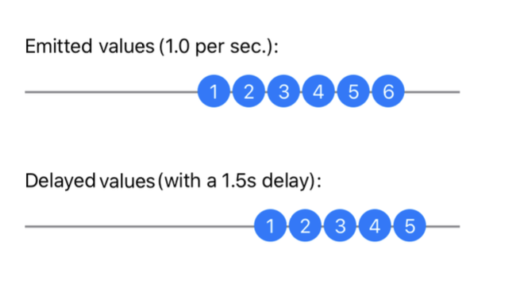
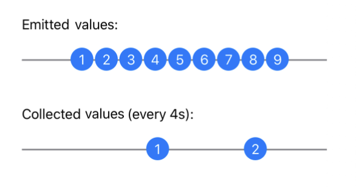
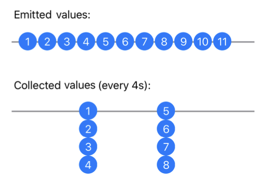
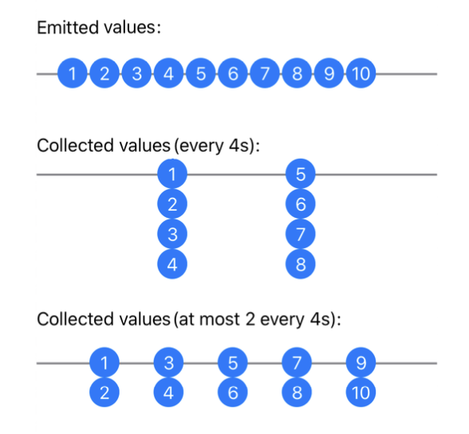

# Chapter 6: Time Manipulation Operators
**Bongjin Lee**

시간은 모든 것의 핵심입니다. 반응형 프로그래밍의 핵심 아이디어는 비동기 이벤트 흐름을 시간에 따라 모델링하는 것입니다. 이러한 점에서 Combine 프레임워크는 시간이 지남에 따라 값을 변환하고 반응하는 시퀀스를 처리할 수 있는 다양한 연산자를 제공합니다.

이 장 전체에서 보게 되겠지만, 값 시퀀스의 시간 차원을 관리하는 것은 쉽고 간단합니다. Combine과 같은 프레임워크를 사용할 때의 큰 이점 중 하나입니다.

## Getting started

시간 조작 연산자에 대해 배우기 위해 데이터가 시간에 따라 흐르는 방식을 시각화하는 애니메이션 Xcode Playground에서 연습할 것입니다. 이 장에는 프로젝트 폴더에 있는 시작용 Playground가 포함되어 있습니다.

Playground는 여러 페이지로 나뉘어져 있습니다. 각 페이지를 사용하여 하나 이상의 관련 연산자를 연습할 것입니다. 또한 예제를 작성하는 데 유용한 준비된 클래스, 함수 및 샘플 데이터가 포함되어 있습니다.

Playground가 렌더된 마크업을 표시하도록 설정되어 있다면 각 페이지 하단에 다음 페이지로 이동할 수 있는 Next 링크가 있습니다.

## Shifting time
때때로 시간 여행이 필요할 때가 있습니다. Combine은 과거의 관계 실수를 고칠 수는 없지만, 시간의 흐름을 잠시 멈추어 자가 복제가 가능해질 때까지 기다릴 수 있게 해줍니다.

가장 기본적인 시간 조작 연산자는 퍼블리셔가 내보내는 값을 지연시켜 실제 발생한 시점보다 나중에 볼 수 있게 합니다.

delay(for:tolerance:scheduler
) 연산자는 전체 값 시퀀스를 시간 이동시킵니다. 상위 퍼블리셔가 값을 내보낼 때마다 delay는 지정한 지연 시간만큼 값을 보유한 후, 지정한 Scheduler에서 그 값을 내보냅니다.

Delay 플레이그라운드 페이지를 열어 시작해 보세요. 가장 먼저 보게 될 것은 Combine 프레임워크뿐만 아니라 SwiftUI도 가져오고 있다는 것입니다! 이 애니메이션 플레이그라운드는 SwiftUI와 Combine으로 구축되었습니다. 모험적인 기분이 들면 Sources 폴더의 코드를 탐색해 보는 것도 좋은 아이디어입니다.

하지만 먼저 해야 할 일부터 시작해 보겠습니다. 나중에 조정할 수 있는 몇 가지 상수를 정의해 보세요:

```
let valuesPerSecond = 1.0
let delayInSeconds = 1.5
```

1초마다 값을 내보내는 퍼블리셔를 생성한 후, 이를 1.5초 지연시키고 두 타임라인을 동시에 표시하여 비교할 것입니다. 이 페이지의 코드를 완성하면 상수를 조정하고 타임라인에서 결과를 확인할 수 있습니다.

다음으로, 필요한 퍼블리셔를 생성해 보세요:

```
// 1
let sourcePublisher = PassthroughSubject<Date, Never>()
// 2
let delayedPublisher =
sourcePublisher.delay(for: .seconds(delayInSeconds), scheduler:
DispatchQueue.main)
// 3
let subscription = Timer
  .publish(every: 1.0 / valuesPerSecond, on: .main, in: .common)
  .autoconnect()
  .subscribe(sourcePublisher)
```

이 코드를 분석해 보겠습니다:

1. sourcePublisher는 Timer가 내보내는 날짜를 전달할 간단한 Subject입니다. 여기서 값의 유형은 중요하지 않습니다. 퍼블리셔가 값을 내보내는 시점과 지연된 값이 나타나는 시점을 시각화하는 것이 중요합니다.

2. delayedPublisher는 sourcePublisher가 내보내는 값을 지연시키고, 이를 메인 스케줄러에서 내보냅니다. 스케줄러에 대해서는 17장 "Schedulers"에서 모두 배울 것입니다. 지금은 값이 메인 큐에 도달하여 표시될 준비가 되어야 한다는 것을 지정하세요.

3. 메인 스레드에서 1초마다 값을 전달하는 타이머를 생성합니다. autoconnect()를 사용하여 즉시 시작하고, 타이머가 내보내는 값을 sourcePublisher 주제에 전달합니다.

```
참고: 이 특정 타이머는 Foundation Timer 클래스의 Combine 확장입니다. 예상할 수 있는 DispatchQueue가 아닌 RunLoop와 RunLoop.Mode를 인수로 받습니다. 타이머에 대해서는 11장 "Timers"에서 모두 배울 것입니다. 또한, 타이머는 연결 가능한 퍼블리셔 클래스의 일부입니다. 이는 값이 방출되기 전에 연결되어야 한다는 것을 의미합니다. autoconnect()를 사용하면 첫 번째 구독 시 즉시 연결됩니다.
```

이제 이벤트를 시각화할 두 개의 뷰를 생성하는 부분에 도달했습니다. 다음 코드를 플레이그라운드에 추가하세요:

```
// 4
let sourceTimeline = TimelineView(title: "Emitted values (\
(valuesPerSecond) per sec.):")
// 5
let delayedTimeline = TimelineView(title: "Delayed values (with
a \(delayInSeconds)s delay):")
// 6
let view = VStack(spacing: 50) {
  sourceTimeline
  delayedTimeline
}
// 7
PlaygroundPage.current.liveView = UIHostingController(rootView:
view)
```

 4. 타이머가 내보내는 값을 표시할 TimelineView를 생성합니다. TimelineView는 SwiftUI 뷰이며, 그 코드는 Sources/Views.swift에서 찾을 수 있습니다.
5. 지연된 값을 표시할 또 다른 TimelineView를 생성합니다.
6. 두 타임라인을 위아래로 표시하기 위한 간단한 SwiftUI 수직 스택을 생성합니다.
7. 이 플레이그라운드 페이지의 라이브 뷰를 설정합니다.

이 단계에서는 화면에 두 개의 빈 타임라인이 표시됩니다. 이제 각 퍼블리셔가 내보내는 값으로 이 타임라인들을 채워야 합니다! 다음의 최종 코드를 플레이그라운드에 추가하세요:

```
sourcePublisher.displayEvents(in: sourceTimeline)
delayedPublisher.displayEvents(in: delayedTimeline)
```

이 마지막 코드 조각에서, 원본과 지연된 퍼블리셔를 각자의 타임라인에 연결하여 이벤트를 표시합니다.

이 소스 변경 사항을 저장하면 Xcode가 플레이그라운드 코드를 다시 컴파일하고... 라이브 뷰 창을 확인해 보세요! 드디어!



두 개의 타임라인이 보일 것입니다. 상단 타임라인은 타이머가 내보낸 값을 보여줍니다. 하단 타임라인은 동일한 값을 지연된 상태로 보여줍니다. 원 안의 숫자는 실제 값이 아니라 내보낸 값의 개수를 나타냅니다.

```
참고: 라이브로 관찰 가능한 다이어그램을 보는 것은 흥미롭지만 처음에는 혼란스러울 수 있습니다. 정적 타임라인은 일반적으로 값을 왼쪽에 정렬하지만, 조금 더 생각해 보면 가장 최근 값이 오른쪽에 있으며, 이는 지금 관찰 중인 애니메이션 다이어그램과 동일합니다.
```

## Collecting values
특정 상황에서는 퍼블리셔가 지정된 간격으로 내보낸 값을 수집해야 할 수도 있습니다. 이는 유용한 버퍼링의 한 형태입니다. 예를 들어, 짧은 기간 동안 값 그룹의 평균을 구하고 그 평균을 출력하고 싶을 때 유용합니다.

Collect 페이지로 전환하려면 하단의 Next 링크를 클릭하거나 프로젝트 탐색기 또는 점프 바에서 선택하세요.

이전 예제와 마찬가지로 일부 상수로 시작합니다:
```
let valuesPerSecond = 1.0
let collectTimeStride = 4
```
이 상수를 읽으면 전체 진행 방향에 대한 아이디어를 얻을 수 있습니다. 이제 퍼블리셔를 생성하세요:
```
// 1
let sourcePublisher = PassthroughSubject<Date, Never>()
// 2
let collectedPublisher = sourcePublisher
  .collect(.byTime(DispatchQueue.main, .seconds(collectTimeStrid
e)))
```
이전 예제와 마찬가지로:

1. 타이머가 내보낸 값을 발행하는 주제를 설정합니다.

2. collect 연산자를 사용하여 collectTimeStride 동안 발행된 값을 수집하는 collectedPublisher를 생성합니다. 이 연산자는 이러한 값 그룹을 지정된 스케줄러인 DispatchQueue.main에서 배열로 발행합니다.

```
참고: collect 연산자에 대해 3장 "Transforming Operators"에서 배운 것을 기억할 것입니다. 그때는 단순한 숫자를 사용하여 값을 그룹화하는 방법을 정의했습니다. 방금 사용한 collect의 오버로드는 값을 그룹화하는 전략을 받아들입니다. 이 경우에는 시간에 따라 그룹화합니다.
```
다시 타이머를 사용하여 지연 연산자와 마찬가지로 값을 정기적으로 발행합니다:
```
let subscription = Timer
  .publish(every: 1.0 / valuesPerSecond, on: .main, in: .common)
  .autoconnect()
  .subscribe(sourcePublisher)
```
다음으로, 이전 예제와 마찬가지로 타임라인 뷰를 생성합니다. 그런 다음, 소스 타임라인과 수집된 값의 타임라인을 표시하는 수직 스택으로 플레이그라운드의 라이브 뷰를 설정합니다:
```
let sourceTimeline = TimelineView(title: "Emitted values:")
let collectedTimeline = TimelineView(title: "Collected values
(every \(collectTimeStride)s):")
let view = VStack(spacing: 40) {
  sourceTimeline
  collectedTimeline
}
PlaygroundPage.current.liveView = UIHostingController(rootView:
view)
```
마지막으로, 두 퍼블리셔로부터 이벤트를 타임라인에 전달하세요:
```
sourcePublisher.displayEvents(in: sourceTimeline)
collectedPublisher.displayEvents(in: collectedTimeline)
```
다 끝났습니다! 이제 라이브 뷰를 잠시 살펴보세요:



정기적인 간격으로 값이 발행되는 Emitted values 타임라인을 볼 수 있습니다. 그 아래에는 4초마다 Collected values 타임라인이 단일 값을 표시합니다. 그런데 그 값은 무엇일까요?
그 값이 지난 4초 동안 수신된 값들의 배열이라는 것을 짐작할 수 있습니다. 배열에 실제로 무엇이 들어 있는지 보기 위해 디스플레이를 개선할 수 있습니다! collectedPublisher 객체를 생성한 줄로 돌아가세요. flatMap 연산자를 사용하여 다음과 같이 추가하세요:
```
let collectedPublisher = sourcePublisher
  .collect(.byTime(DispatchQueue.main, .seconds(collectTimeStrid
e)))
  .flatMap { dates in dates.publisher }
```
3장 "Transforming Operators"에서 배운 친근한 flatMap을 기억하시나요? 여기서 유용하게 사용됩니다: collect가 수집한 값 그룹을 발행할 때마다 flatMap이 다시 개별 값으로 분해하지만, 동시에 발행합니다. 이를 위해 Collection의 퍼블리셔 확장을 사용하여 값 시퀀스를 퍼블리셔로 변환하고, 시퀀스의 모든 값을 개별 값으로 즉시 발행합니다.

이것이 타임라인에 미치는 효과를 살펴보세요:



이제 4초마다 collect가 마지막 시간 간격 동안 수집된 값의 배열을 발행하는 것을 볼 수 있습니다.

## Collecting values (part 2)

collect(_:options:) 연산자가 제공하는 두 번째 옵션은 일정한 간격으로 값을 계속 수집할 수 있게 합니다. 또한, 수집된 값의 수를 제한할 수 있습니다.
동일한 Collect 페이지에서, 상단의 collectTimeStride 아래에 새 상수를 추가하세요:
```
   let collectMaxCount = 2
```
다음으로, collectedPublisher 뒤에 새 퍼블리셔를 생성하세요:
```
let collectedPublisher2 = sourcePublisher
  .collect(.byTimeOrCount(DispatchQueue.main,
                          .seconds(collectTimeStride),
                          collectMaxCount))
  .flatMap { dates in dates.publisher }
```
이번에는 .byTimeOrCount(Context, Context.SchedulerTimeType.Stride, Int) 변형을 사용하여 한 번에 최대 collectMaxCount 값을 수집합니다. 이게 무슨 의미일까요? 계속해서 코드를 추가하면 알게 될 것입니다!

collectedTimeline과 let view = VStack... 사이에 두 번째 collect 퍼블리셔를 위한 새로운 TimelineView를 추가하세요:

```
let collectedTimeline2 = TimelineView(title: "Collected values
(at most \(collectMaxCount) every \(collectTimeStride)s):")
```
그리고 물론 뷰 스택 목록에 추가하여 view가 다음과 같이 보이도록 하세요:
```
let view = VStack(spacing: 40) {
  sourceTimeline
  collectedTimeline
  collectedTimeline2
}
```
마지막으로, 플레이그라운드의 끝에 다음 코드를 추가하여 타임라인에 이벤트를 표시하도록 하세요:
```
   collectedPublisher2.displayEvents(in: collectedTimeline2)
```
이제 이 타임라인을 잠시 실행하여 차이점을 확인하세요:



여기서 두 번째 타임라인이 collectMaxCount 상수에 의해 한 번에 두 개의 값만 수집하도록 제한되는 것을 볼 수 있습니다. 이는 알아두면 유용한 도구입니다!

## Holding off on events
사용자 인터페이스를 코딩할 때 자주 텍스트 필드를 다루게 됩니다. Combine을 사용하여 텍스트 필드 내용을 액션에 연결하는 것은 일반적인 작업입니다. 예를 들어, 텍스트 필드에 입력된 내용을 바탕으로 검색 URL 요청을 보내고, 일치하는 항목 목록을 반환받고자 할 수 있습니다.

하지만 사용자가 한 글자씩 입력할 때마다 요청을 보내고 싶지는 않을 것입니다! 사용자가 입력을 마쳤을 때만 텍스트를 받아들이는 메커니즘이 필요합니다.

Combine은 여기서 도움이 될 두 가지 연산자를 제공합니다: debounce와 throttle입니다. 이를 살펴보겠습니다!

## Debounce
Debounce라는 이름의 플레이그라운드 페이지로 전환하세요. Debug 영역이 확장되어 있는지 확인하세요 — View ▸ Debug Area ▸ Activate Console — 그러면 debounce가 내보내는 값의 출력 내용을 볼 수 있습니다.

몇 개의 퍼블리셔를 생성하는 것으로 시작하세요:
```
// 1
let subject = PassthroughSubject<String, Never>()
// 2
let debounced = subject
  .debounce(for: .seconds(1.0), scheduler: DispatchQueue.main)
  // 3
  .share()
```
이 코드에서:

1. 문자열을 내보낼 소스 퍼블리셔를 생성합니다.

2. debounce를 사용하여 subject로부터 1초 동안 대기합니다. 그런 다음, 해당 1초 간격 동안 마지막으로 전송된 값을 보냅니다. 이렇게 하면 1초에 최대 하나의 값만 전송할 수 있습니다.

3. debounced에 여러 번 구독할 예정입니다. 결과의 일관성을 보장하기 위해 share()를 사용하여 debounce에 단일 구독 지점을 생성하여 모든 구독자에게 동시에 동일한 결과를 보여줍니다.
```
참고: share() 연산자에 대해 깊이 다루는 것은 이 장의 범위를 벗어납니다. 단일 구독 지점이 여러 구독자에게 동일한 결과를 전달해야 할 때 유용하다는 점만 기억하세요. share()에 대해 더 알고 싶다면 13장 "Resource Management"에서 배우게 될 것입니다.
```
다음 몇 가지 예제를 위해, 텍스트 필드에 사용자가 텍스트를 입력하는 것을 시뮬레이션하는 데이터를 사용할 것입니다. 이를 직접 입력하지 마세요 — 이미 Sources/Data.swift에 구현되어 있습니다:
```
public let typingHelloWorld: [(TimeInterval, String)] = [
  (0.0, "H"),
  (0.1, "He"),
  (0.2, "Hel"),
  (0.3, "Hell"),
  (0.5, "Hello"),
  (0.6, "Hello "),
  (2.0, "Hello W"),
  (2.1, "Hello Wo"),
  (2.2, "Hello Wor"),
  (2.4, "Hello Worl"),
  (2.5, "Hello World")
]
```
시뮬레이션된 사용자는 0.0초에 타이핑을 시작하고, 0.6초 후에 멈추고, 2.0초에 다시 타이핑을 시작합니다.
```
참고: Debug 영역에서 보게 될 시간 값은 0.1초 또는 0.2초 정도 오차가 있을 수 있습니다. DispatchQueue.asyncAfter()를 사용하여 메인 큐에서 값을 내보낼 것이므로 값 사이의 최소 시간 간격은 보장되지만 요청한 시간과 정확히 일치하지 않을 수 있습니다.
```
플레이그라운드의 Debounce 페이지에서 이벤트를 시각화하기 위해 몇 개의 타임라인을 생성하고 두 퍼블리셔에 연결하세요:
